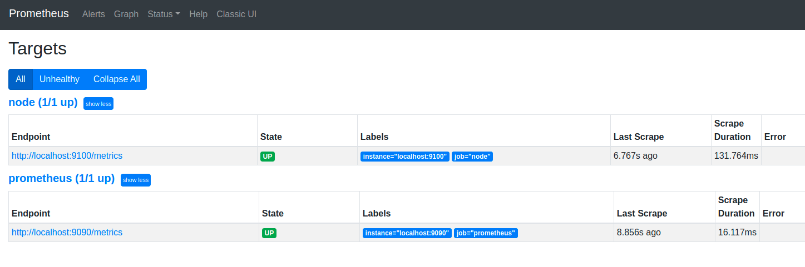
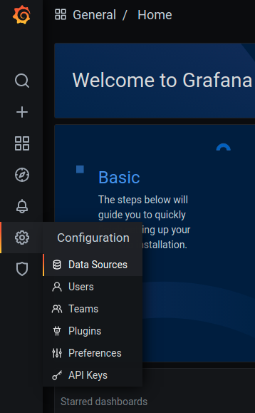
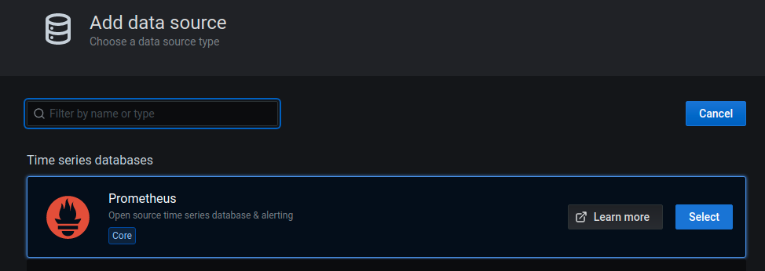
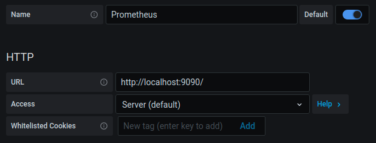
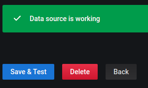
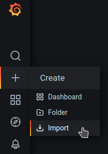
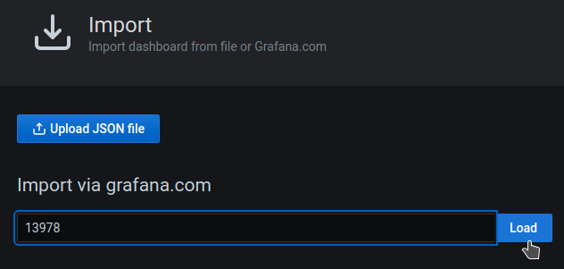
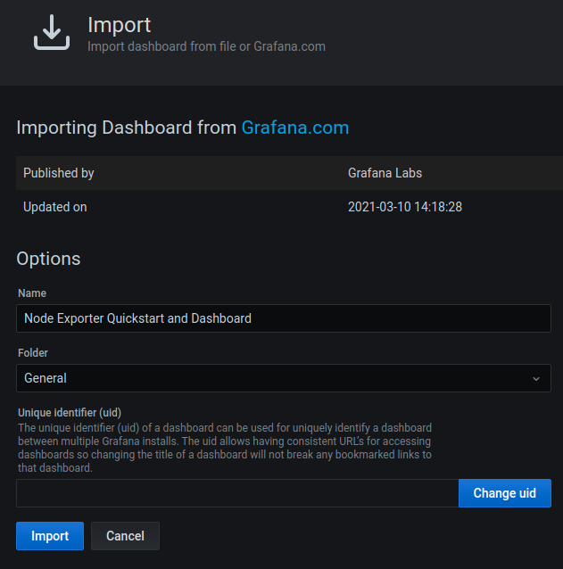
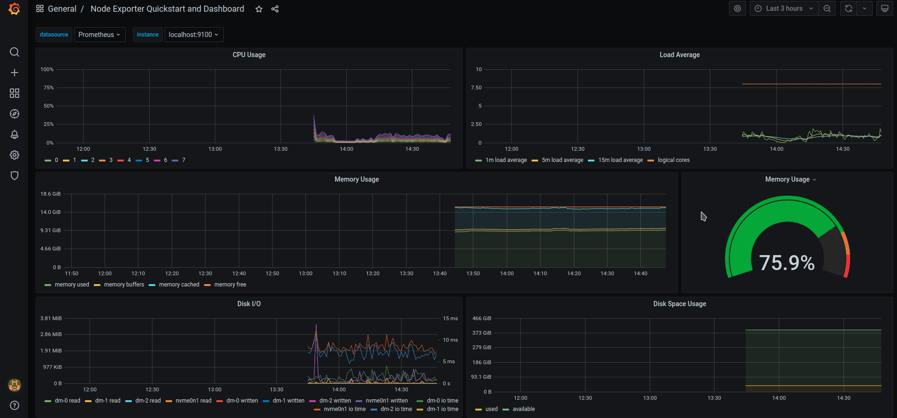

# prometheus-podman-demo


Note: If you are using docker instead of podman, simply replace `podman` with `docker` when running the containers. All the steps should be the same.  

Prereqs:
- Running either podman or docker.
- Clone this repo:
```
git clone https://github.com/dchats1/prometheus-podman-demo.git
cd prometheus-podman-demo
```

1. Run the node-exporter container (https://github.com/prometheus/node_exporter)
```
podman run -d --net host --name prometheus-demo-node-exporter quay.io/prometheus/node-exporter
```

2. Run the Prometheus container:
```
podman run -d --net host --name prometheus-demo-prometheus -v ./prometheus.yml:/etc/prometheus/prometheus.yml:z quay.io/prometheus/prometheus
```

3. In your browser, navigate to http://localhost:9090/  
If you navigate to the 'Status' menu, and select 'Targets' page you should be able to see the node and prometheus job. If everything is working correctly both with show a state of 'UP'. They may take a minute to run the intial scrape. Reload the page if the State shows 'Unknown'.



4. Run Grafana:
```
podman run -d --net host --name prometheus-demo-grafana grafana/grafana
```

5. Once Grafana has started, navigate to http://localhost:3000/ in your browser. The default login will be admin/admin. Grafana will prompt you to change the admin password. This part can be skipped for the demo.
  
6. To add a new target navigate to the data sources page under 'Configuration' > 'Data Sources':


7. On the Data Sources page, click on 'Add data source'. By default there will be a list of available datasources. The first option will be 'Prometheus. Select the Prometheus data source.



8. Under the HTTP section, add the URL of the Prometheus container. In this case it will be http://localhost:9090  
Next, scroll to the bottom and click 'Save & Test'. If Grafana can reach the Prometheus server it will reply with 'Data source is working'.




9. Now, import the 'Node Exporter Quickstart and Dashboard' prebuilt dashboard (ID: 13978)  
https://grafana.com/grafana/dashboards/13978?pg=dashboards&plcmt=featured-sub1  

Start by Navigating to 'Create' > 'Import':


Then, enter the Dashboard ID into the 'Import via grafana.com' field:


Lastly, you have the option to change the name or folder, then Import the dashboard.


Once imported, you will be brought to the newly imported dashboard page. Here you should start seeing your metrics:


10. Cleanup:
```
# Stop and Remove the running containers:
podman rm -f prometheus-demo-node-exporter prometheus-demo-prometheus prometheus-demo-grafana

# Clean up images:
podman rmi node-exporter prometheus grafana
```
